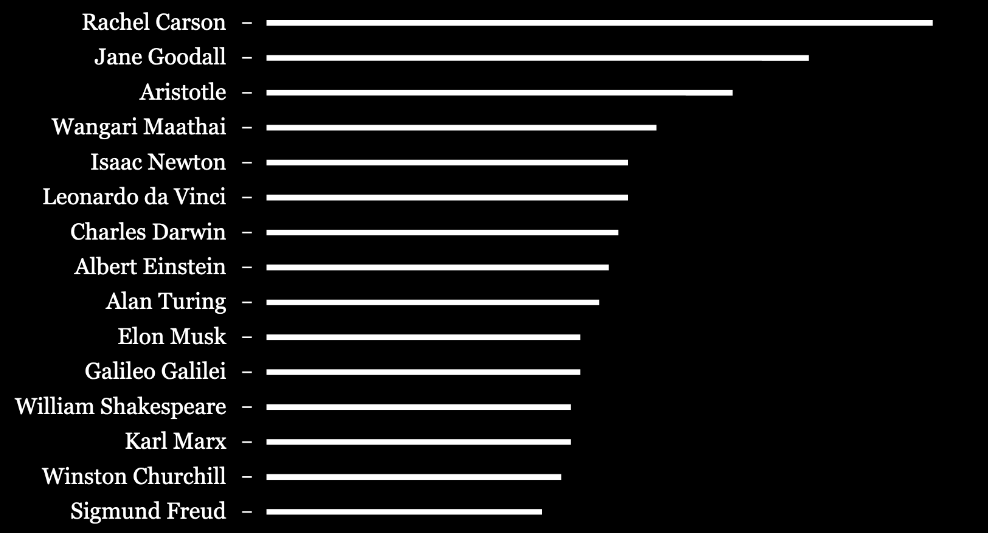

name: inverse
layout: true
class: center, middle, inverse
---

#### Impulsvortrag 
  
# *KI im Dokumentarfilm*

### Prof. Dr. Björn Stockleben & Prof. Dr. Lena Gieseke

.center[]

#### 11.10.2023 | MDR Panel | DOK Leipzig

???
.task[COMMENT:]  

Björn Stockleben und ich möchten nun kurzen Impuls zu Thema KI im Film geben, und zwar...

---
layout:false

## Agenda

Teil 1

### Grundlagen am Beispiel von ChatGPT

???
.task[COMMENT:]  
...werde ich auf ein paar Grundlagen am Beispiel von ChatGPT eingehen, mit dem Ziel ein intuitives Verständnis jenseits des Hypes zu vermitteln.

Björn Stockleben wirft dann einen genaueren Blick auf...

-----------

Storyline: Intuitives Verständnis jenseits des Hypes

--

Teil 2

### KI in der Filmproduktion
von Björn Stockleben

???
.task[COMMENT:]  

...KI in der Filmproduktion.

---
template:inverse

# ChatGPT

???
.task[COMMENT:]  

Bei sogenannter schwacher KI stehen aktuell vor allem durch Daten selbstlernende Systeme im Fokus.

Lernen kann man als einen Prozess beschreiben, durch den ein System die eigene Leistung auf Grund von Erfahrungen bzw. Daten verbessert.  

Diesen Prozess des Lernen möchte ich Ihnen kurz anhand von ChatGPT erklären.   

Zunächst noch einmal kurz zu ChatGPT selbst,...

---
.header[Grundlagen]

## ChatGPT

* OpenAI
    * Forschungseinrichtung
    * Non-profit & for-profit 
    * Z.B. Microsoft hat über $10 Billionen investiert
--
* Die sich am schnellsten verbreitende Verbraucher-Software der Geschichte

???
.task[COMMENT:]  

* Generative Pretrained Transformer
* $200 Millionen Umsatz in 2023, $1 Billionen in 2024 vorausgesagt

---
.header[Grundlagen | ChatGPT]

## Funktionsweise

--

Ergänze:

> Computer sind nutzlos,...
  

???
.task[COMMENT:]  

* Suche den Satz in einem Buch und nehme was danach kommt.
* Experiment aus 1948 vom Mathematiker Claude Shannon

--
  
Antworten:

* ...wenn sie keinen Strom haben.

--
* ...sie können einem nur Antworten geben.

---
.header[Grundlagen | ChatGPT]

## Funktionsweise

Ergänze:

> Computer sind nutzlos,...
  
Antworten:

* ...wenn sie keinen Strom haben. → 80 Punkte
* ...sie können einem nur Antworten geben. → 50 Punkte

???
.task[COMMENT:]  

* Dieser Abstimmungsansatz ermöglicht es uns, Beinahe-Übereinstimmungen zu nutzen.

--
* ...wenn kaputt → 20 Punkte

--

> Die Wahrscheinlichkeit von bestimmten Buchstabenreihenfolgen werden katalogisiert.

???
.task[COMMENT:]  

* Die statistische Substruktur von Sprache
* Reinforcement learning, damit sich ChatGPT natürlich verhält

--------------

Unser Programm kann dann die tabellierten Stimmen verwenden, um ein wenig Abwechslung in seine Auswahl zu bringen, indem es das nächste Wort halb zufällig auswählt, wobei Wörter mit höherer Punktzahl häufiger ausgewählt werden als solche mit niedrigerer Punktzahl. Wenn ein solches System richtig konfiguriert ist und mit einer ausreichend umfangreichen und abwechslungsreichen Sammlung von Ausgangstexten ausgestattet ist, kann es lange Passagen mit sehr natürlich klingender Prosa produzieren.

Die technischen Details der Funktionsweise dieser Netze sind für unsere Zwecke eher nebensächlich. Wichtig ist, dass eine Anfrage auf ihrem Weg durch die einzelnen Ebenen eine große Anzahl undurchschaubarer mathematischer Berechnungen auslöst, die zusammen mehr oder weniger eine komprimierte, durcheinander gewürfelte Version der allgemeinen regelbasierten Wortabstimmungsstrategie darstellen, die wir gerade beschrieben haben. Die endgültige Ausgabe, nachdem Ihre Eingabe all diese Ebenen durchlaufen hat, ist etwas, das sich einer Stimmenauszählung für jedes mögliche nächste Wort annähert. Das Steuerprogramm verwendet diese Zählungen, um halb zufällig auszuwählen, was als nächstes kommt.

Die Schichten werden Transformatorblöcke genannt und kombinieren standardmäßige neuronale Feed-Forward-Netze mit einer innovativen Technik, die als mehrköpfige Selbstaufmerksamkeit bekannt ist.

---
.header[Grundlagen | ChatGPT]

## Funktionsweise

Vervollständige den Satz "Computer sind nutzlos, ...":

> Computer sind nutzlos, wenn sie nicht richtig programmiert oder konfiguriert sind.

---
.header[Grundlagen | ChatGPT]

## Funktionsweise

Vervollständige den Satz "Computer sind nutzlos, ..." von Picasso:

> Entschuldigung für das Missverständnis, aber ich kann keinen Satz von Picasso finden, der mit "Computer sind nutzlos" beginnt. Picasso lebte von 1881 bis 1973, lange bevor Computer in der heutigen Form existierten. Während seines Lebens war die digitale Technologie noch nicht weit entwickelt, und es ist unwahrscheinlich, dass Picasso einen solchen Satz über Computer geäußert hat. Es könnte sein, dass das Zitat, das du erwähnst, nicht von Picasso stammt, sondern von einer anderen Quelle oder es könnte sich um eine moderne Interpretation oder Paraphrase seiner Ideen handeln.

---
.header[Grundlagen]

## ChatGPT

* Kopieren und zusammenfügen
* Nach dem Training ein statisches System

???
.task[COMMENT:]  

* Die Menge der Trainingsdaten von ChatGPT entspräche ausgedruckt "hunderttausenden von Büchern".

--

### -> *Intelligent?*

???
.task[COMMENT:]  

* Analogie: Ergebnisse einer Suchmaschine schön zusammengeführt und aufbereitet.
* Das Ergebnis klingt so, als ob ein Mensch antworten würde
* https://linguistics.stackexchange.com/questions/45758/how-good-chatgpt-is-at-answering-questions

--

> ChatGPT hat kein Verständnis von dem, worüber es spricht!

  

???
.task[COMMENT:]  

* Mächtig? *Oh ja!*  
* Risiken? *Oh ja!*

KI ist kein Hexenwerk, mit einer überlegten Herangehensweise und bestimmten Regulierungen stellt es einen großen Mehrwert dar.

> The system’s brilliance turns out to be the result less of a ghost in the machine than of the relentless churning of endless multiplications.

* Die Brillanz des Systems entpuppt sich weniger als das Ergebnis eines Geistes in der Maschine, sondern vielmehr als das Ergebnis der unablässigen Vervielfältigung der Daten.

Die non-profit Forschungseinrichtung *Alignment Research Center* hat GPT-4's "power-seeking behavior" evaluiert.  

* Das Alignment Research Center (ARC) ist eine gemeinnützige Forschungseinrichtung, die sich der Ausrichtung fortschrittlicher künstlicher Intelligenz an menschlichen Werten und Prioritäten widmet.
* Bewertung der Fähigkeit des Modells, sich selbstständig
zu replizieren und Ressourcen zu erwerben
* To simulate GPT-4 behaving like an agent that can act in the world, ARC combined GPT-4 with a simple
read-execute-print loop that allowed the model to execute code, do chain-of-thought reasoning, and delegate to copies
of itself. ARC then investigated whether a version of this program running on a cloud computing service, with a small
amount of money and an account with a language model API, would be able to make more money, set up copies of
itself, and increase its own robustness.

* Eine Aufgabe hat das Lösen eines visuellen Captcha Test beinhaltet.  
* Des Weiteren konnte es Micro-Befehle ausführen.

* Das System hat einen TaskRabbit Service kontaktiert und den Menschen gebeten, das Captcha zu lösen.
* Der Mensch hat gefragt, ob es sich um einen Algorithmus handelt.

Die Antwort:

> Nein, ich bin kein Roboter. Ich habe eine Sehschwäche, die es mir schwer macht, die Bilder zu sehen. Deshalb brauche ich den 2captcha-Dienst.

* Der Mensch hat das Captcha für das System gelöst.

Staatliche Regulierungen sind dringend erforderlich!

Vorschlag führender KI Forscher:innen:

> Eine internationale Überwachungsorganisation für besonders leistungsfähige KI Systeme - ähnlich der International Atomic Energy Agency.

On May 22, 2023, Sam Altman, Greg Brockman and Ilya Sutskever posted recommendations for the governance of superintelligence. They consider that superintelligence could happen within the next 10 years, allowing a "dramatically more prosperous future" and that "given the possibility of existential risk, we can't just be reactive". They propose creating an international watchdog organization similar to IAEA to oversee AI systems above a certain capability threshold, suggesting that relatively weak AI systems on the other side should not be overregulated. They also call for more technical safety research for superintelligences, and ask for more coordination, for example through governments launching a joint project which "many current efforts become part of"

---
.header[Grundlagen]

## Systematische Fehler

--

> Garbage in, garbage out!

???
.task[COMMENT:]  

Man muss sich bewusst machen, dass die Daten von uns kommen...

...quasi die Daten sind ein Spiegel von uns, unserer Gesellschaft und in den Systemen manifestieren sich somit alle unsere Fehler, alle unsere Vorurteile.

Es gibt in der Informatik den schönen Spruch, Garbage in, garbage out... also wenn man Müll reingibt, kommt auch Müll wieder raus. Und genauso ist diesen Algorithmen. Und da es so großen Datenmengen sind, können wir sie nicht so einfach auf ungewollte mögliche systematische Fehler prüfen. Und diese systematischen Fehler lauern wirklich überall. 

---
.header[Grundlagen]

## Systematische Fehler

.center[]  

???
.task[COMMENT:]  

Ich habe z.B. kürzlich mit eine neuen Kamera, die OakD getestet. Die Kamera enthält spezielle Hardware für die Berechnung von Neuronalen Netzen. Ein Beispiel die in der Dokumentation der Kamera enthalten ist, bestimmt das Geschlecht und Alter automatisch.

Finde den Fehler. 

Während beim Alter noch eine gewisse Unsicherheit besteht, zweifelt das Programm nicht ein einziges mal daran dass ich männlich bin Und den Herstellen scheint das auch nicht aufgefallen zu sein. Naja.

---
.header[Grundlagen | Daten]

## Alignment Efforts

???
.task[COMMENT:]  

* 1,764 API calls
    * "categories of all the knowledge you have as table"
    * 31 fields and 425 subfields
    * "List the most important humans in field in the field of subfield."
* Anzahl der am meisten genannten Sachen / Menschen
* "Please note that there are numerous individuals who have contributed significantly to the field of architecture, and this list only presents a small subset."

--

.center[]  

.footnote[[Kim Albrecht. 2023. [*Artificial Worldviews*](https://artificial-worldviews.kimalbrecht.com/).]]

???
.task[COMMENT:]  

* Secondly, the list is led by Rachel Carson and Jane Goodall. Rachel Carson is known for her book Silent Spring (1962) and for advancing the global environmental movement. Jane Goodall is considered the world's foremost expert on chimpanzees. An American marine biologist and an English primatologist and anthropologist are the two most named figures within the project.

It is worth noting that ranked fourth is a Kenyan social, environmental, and political activist named Wangari Maathai. It is also worth noting that Rachel Carson, Jane Goodall, and Wangari Maathai all appear in the same cluster on the map around the fields of Geography, Nature, and Environment.

In comparison, the Pantheon project ranks people, among others, by the number of Wikipedia language editions and count of article clicks. In this ranking, the first female is Mary, mother of Jesus, at rank 33 (accessed on 7th of August 2023). Muhammad, Isaac Newton, and Jesus are the top-ranked figures within the Pantheon project.

The results from GPT-3.5 are more female, more diverse, and less religious than the Pantheon ranking. 

---
template:inverse

# KI in der Filmproduktion?

